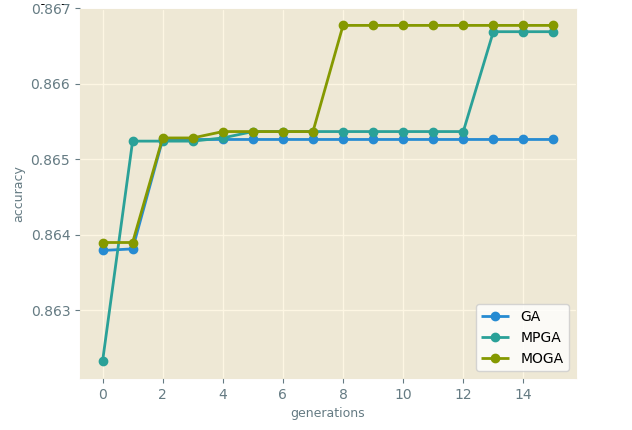

## Improved genetic algorithms for feature selection

Recently, researches on feature selection are mainly focused on two aspects: criteria and searching strategies. Searching for the best m features out of the n available for classification task is known to be an NP-hard problem. An exhaustive evaluation of possible feature subsets is usually unfeasible in practice due to the large amount of computational effort required. A wide range of heuristic search strategies has been used including hill-climbing, genetic algorithm.

Here, let's focus on the genetic algorithm and its improvements for feature selection problem. Specifically, I deployed two modifications of genetic algorithms including Multiple Population Genetic Algorithm and Multi-Objective Genetic Algorithm.

Detail on:

Results and comparison:
<table>
  <tr>
    <td> Evolutionary processes of GA, MPGA, and MOGA (Australia credit data set)
  </tr>
  
  <tr>
    <td> 
  </tr>
</table>
